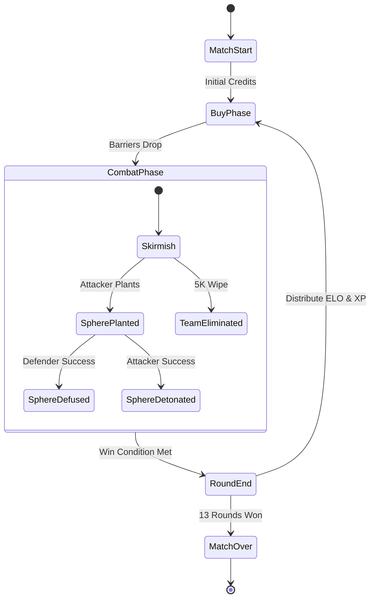
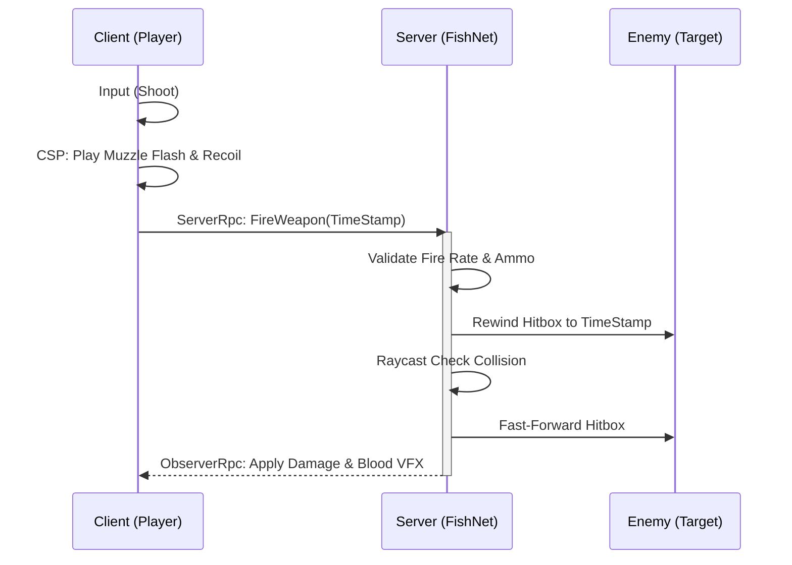
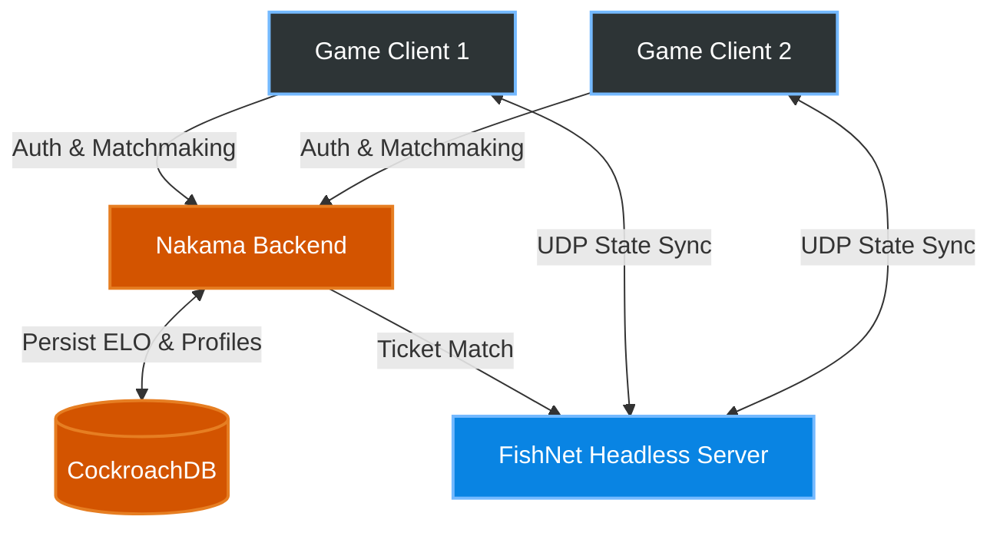
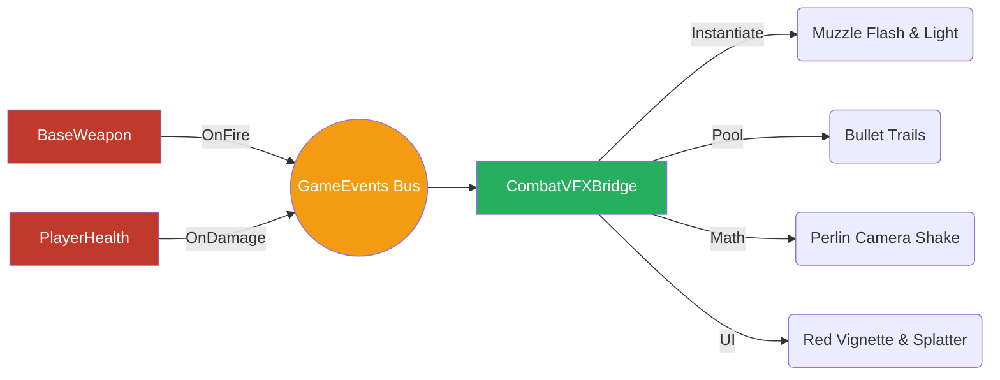

<div align="center">
  
  
  
  
</div>

# ProjectZ: The Ultimate Tactical Hero Shooter 🎯

**ProjectZ** is a next-generation competitive 5v5 Tactical Hero Shooter. Blending the unforgiving, precision-based gunplay of classic competitive shooters with the chaotic, dynamic variables of hero abilities, ProjectZ is built from the ground up for eSports, competitive integrity, and a premium "game feel."

---

## 📖 Lore & Setting

Set in a near-future cyberpunk metropolis fractured by the discovery of "Z-Energy"—a paradoxical substance capable of bending time, space, and local physics—clandestine factions deploy highly specialized agents ("Heroes") to secure extraction zones. It is a tactical war of information, precision, and ultimate abilities.

---

## 🎮 Core Gameplay Loop

ProjectZ follows a highly structured, competitive **Round-Based Economy** loop:
1. **Buy Phase:** Players use credits earned from kills, assists, and round outcomes (Win/Loss/Loss-Streak) to purchase weapons, armor, and abilities natively through the `BuyMenuUI`.
2. **Combat Phase:** A lethal 5v5 engagement. Time-to-Kill (TTK) is extremely low. A single well-placed headshot from a Heavy Assault Rifle is fatal.
3. **Objective (The Sphere):** The Attacking team must plant the **Sphere** at designated Sites (A, B, or C). The Defending team must hold the sites, defuse the Sphere, or eliminate all attackers.
4. **Round End & Progression:** The `RoundManager` tabulates ELO, distributes XP, updates the `ScoreboardUI`, and seamlessly transitions players to the next round.



---

## 📈 Dynamic Weapon Mastery System

One of ProjectZ's most innovative features is its **Dynamic Weapon Mastery** loop. It is a live, in-match progression system where a player's mechanical performance directly impacts the physical attributes of their held weapon. 

If a player executes flawless headshots, their weapon levels up rapidly, unlocking faster reload times and tighter ADS (Aim-Down-Sights) speeds. However, if a player performs poorly or dies repeatedly, their weapon *loses* XP and its performance degrades mid-round.

### 🌟 Mastery XP Logic 
The system spans from **Level I** (0 XP) to **Level V** (4000+ XP). Each level threshold requires 1000 XP.

| Combat Action | Target/Condition | XP Modifier | System Rationale |
| :--- | :--- | :---: | :--- |
| **Kill** | Headshot | <font color="#2ECC71"><b>+100 XP</b></font> | Maximally rewards pinpoint mechanical precision. |
| **Kill** | Body / Leg | <font color="#3498DB"><b>+50 XP</b></font> | Standard combat elimination reward. |
| **Assist** | Armor & HP Damaged | <font color="#9B59B6"><b>+50 XP</b></font> | Rewards heavy contribution to a teammate's frag. |
| **Assist** | HP Only | <font color="#1ABC9C"><b>+25 XP</b></font> | Minor assist contribution or shield break. |
| **Utility** | Ultimate Cast | <font color="#F1C40F"><b>+50 XP</b></font> | Rewards active execution of team-based abilities. |
| **Death** | Body / Leg | <font color="#E74C3C"><b>-25 XP</b></font> | Standard penalty for losing a duel. |
| **Death** | Headshot | <font color="#C0392B"><b>-40 XP</b></font> | Harshly penalizes being out-aimed by an opponent. |
| **Penalty** | Cold Streak | <font color="#34495E"><b>-60 XP</b></font> | Triggers if the player secures 0 kills in 3 consecutive rounds. |

### ⚙️ Progression Flow & Stat Buffs
Buffs drastically alter how a weapon *feels* without directly changing its TTK (Damage never increases, only handling/utility metrics). For instance, an Assault Rifle maxed at Level V gains a massive 15% Fire Rate boost, whereas a Max Level Sniper gains a 30% faster ADS speed.

```mermaid
graph TD
    classDef Event fill:#2c3e50,stroke:#34495e,stroke-width:2px,color:#fff;
    classDef Success fill:#27ae60,stroke:#2ecc71,stroke-width:2px,color:#fff;
    classDef Fail fill:#c0392b,stroke:#e74c3c,stroke-width:2px,color:#fff;
    classDef Level fill:#8e44ad,stroke:#9b59b6,stroke-width:2px,color:#fff;

    A[Player Engages in Duel]:::Event
    A -->|Secures Headshot| B(+100 XP):::Success
    A -->|Dies to Headshot| C(-40 XP):::Fail
    
    B --> D{Hits 2000 XP Threshold?}:::Event
    C --> E{Drops Below 2000 XP?}:::Event
    
    D -->|Yes| F((Levels Up to Level III)):::Level
    E -->|Yes| G((De-levels to Level II)):::Fail
    
    F -->|Apply Buffs| H[15% Faster Reload Speed applied live!]:::Success
    G -->|Strip Buffs| I[Return to Standard Reload Speed]:::Event
```

*Note: Dropping a weapon completely wipes its Mastery XP. A newly picked-up weapon by any player will automatically reset to Level I.*

---

## 🦸 The Roster (13 Playable Agents)

ProjectZ features 13 canonical Agents divided into strategic roles. Ultimate abilities require 100% charge to activate (earned via kills and assists) and are disabled during Pistol Rounds for pure mechanical balance.

1. <font color="#E74C3C"><b>Jacob</b></font> **(The Anchor) - Defense/Strategy**
   * **Ultimate | Siege Breaker:** Creates a definitive tactical opening. Any bullets passing through the designated 3x3m zone lose absolutely zero damage when penetrating walls for the current and subsequent round.
2. <font color="#3498DB"><b>Lagrange</b></font> **(The Flanker) - Duelist/Mobility**
   * **Ultimate | Quantum Rewind:** A high-risk repositioning tool. Teleports Lagrange instantly to the exact location of the last enemy he killed. Must be utilized within 15 seconds of the kill and provides 1 second of invulnerability upon arrival.
3. <font color="#2ECC71"><b>Sentinel</b></font> **(The Support) - Information/Control**
   * **Ultimate | Panopticon:** Deploys a 150HP vision totem. Continuously scans a massive 30m radius, revealing the positions of any enemies caught within its line of sight until destroyed or its 25-second duration expires.
4. <font color="#9B59B6"><b>Sector</b></font> **(The Controller) - Area Control**
   * **Ultimate | Doomsday Charge:** Fires a lethal sticky bomb that detonates after 2 seconds. Inflicts 150 damage within the epicenter (0-2m) with linear falloff up to 8 meters. Enemies caught in its radius can halve the damage by crouching.
5. <font color="#F1C40F"><b>Silvia</b></font> **(The Buffer) - Support/Tempo**
   * **Ultimate | Overdrive Core:** Generates a 60-meter long energy tunnel. Allies moving through the tunnel gain 30% movement speed and a 15% fire-rate buff, while enemies are heavily penalized with a 40% movement speed slow. Duration extends per kill.
6. <font color="#E67E22"><b>Samuel</b></font> **(The Gambler) - Risk/Aggressive**
   * **Ultimate | Blood Pact:** Enters a vampiric frenzy. Firing the weapon drains 5 HP per shot, but securing a kill grants 50 HP (overhealing permitted). Dropping below 30 HP grants Samuel a desperate 1.3x damage multiplier.
7. <font color="#1ABC9C"><b>Jielda</b></font> **(The Hunter) - Crowd Control**
   * **Ultimate | Spirit Wolves:** Unleashes ethereal wolves that autonomously track down the first 3 enemies that have taken damage this round. Upon connection, the wolves inflict a harsh 1.5-second stun. 
8. <font color="#34495E"><b>Zauhll</b></font> **(The Stalker) - Stealth/Flank**
   * **Ultimate | Void Walk:** Shifts completely into the Void. Grants total invisibility and a +25% movement speed boost for 7 seconds, at the cost of restricting vision severely to 3 meters. The first strike out of stealth has 100% lifesteal.
9. <font color="#F39C12"><b>Volt</b></font> **(The Disruptor) - Chaos/Global**
   * **Ultimate | System Failure:** A global blackout. Instantly restricts enemy vision to 5 meters, hides all HUD elements (Minimap, Health bar, Scoreboard), and completely disables enemy team voice chat for 5 seconds.
10. <font color="#D35400"><b>Sai</b></font> **(The Duelist) - Close Combat**
    * **Ultimate | Blade Dance:** Transitions to a lethal melee stance for three targeted strikes. Strikes 1 and 2 cover 4 meters, dealing 75 damage while passively blocking incoming bullets. Strike 3 extends to 6 meters, dealing massive damage and rooting the target.
11. <font color="#8E44AD"><b>Helix</b></font> **(The Intel) - Psychological Pressure**
    * **Ultimate | One-Way Mirror:** Deploys a 2x1.5m tactical window. Helix's team sees clearly through the glass, while the enemy side observes an opaque, wavy energy shield. Helix heals 25 HP for every kill secured from behind the glass.
12. <font color="#C0392B"><b>Kant</b></font> **(The Thief) - Flexible**
    * **Ultimate | Echo:** The ultimate wildcard. Kant approaches any dead player's corpse (within 3m) and permanently steals their designated Ultimate ability, with 5 seconds given to cast the stolen power.
13. <font color="#2980B9"><b>Marcus 2.0</b></font> **(The Acrobat) - Mobility/Initiator**
    * **Ultimate | Grapple Strike:** Fires a physics-based, 25-meter grappling hook. If attached to geometry, pulls Marcus dynamically. If attached to an enemy, deals 25 damage, pulls them, and applies a devastating 40% slow for 3 seconds. Fall damage is negated while active.

---

## ⚙️ In-Depth Gunplay Mechanics

ProjectZ takes weapon mastery to an obsessive level. Our custom mechanics demand pinpoint accuracy, strict movement discipline, and deep systemic knowledge. 

### 🎯 Advanced Recoil & Ballistics
Unlike random-spread shooters, ProjectZ relies on **Procedural Patterning**.
* **Deterministic Spray Patterns:** Sustained fire pushes the weapon vertically before pulling horizontally into structured, learnable shapes.
* **First-Shot Accuracy & Bloom:** The first bullet is laser-accurate when stationary. Firing rapidly increases "Bloom" (spread cone radius). The dynamic `CrosshairUI` physically expands relative to the current Bloom threshold.
* **Camera Kick:** True physical kickback is applied to the player's camera matrix. Controlling a spray requires actively pulling down the mouse to counteract the mathematical Camera Shake algorithm.

### 🏃‍♂️ Movement Discipline & Counter-Strafing
* **Velocity-Based Inaccuracy:** Shooting while sprinting or jumping guarantees your bullet will miss. Firing while walking slightly mitigates spread, but optimal accuracy requires absolute stillness.
* **Counter-Strafing:** Hitting the opposite movement key (e.g., holding `D` while moving `A`) instantly zeroes out horizontal velocity, snapping the player into perfect accuracy immediately. 
* **Audio Masking:** Sprinting creates loud, directional audio footsteps audible through walls. Holding the walk key (Shift) completely masks footstep sounds at the cost of movement speed.

### 🧱 Wallbanging & Material Penetration
Every surface is assigned a `SurfaceMaterial` (Wood, Stone, Metal).
* Bullets utilize raycast-chaining to penetrate geometry. 
* **Damage Drop-off:** A bullet passing through Wood may retain 80% damage, while a bullet passing through Metal might only retain 15%. 
* High-caliber Heavy Snipers penetrate multiple walls easily, while Light Pistols are stopped entirely by a single layer of Stone.

### 🌐 Server-Authoritative Lag Compensation
Since ProjectZ utilizes FishNet v4 Client-Side Prediction:
* **Hitbox Rewinding:** Because of network ping, what a player sees on their screen is slightly outdated. When a player fires, the server takes the exact timestamp of their shot, *rewinds* the physical colliders (`HitboxCapsules`) of all enemies back in time to where they were at that specific millisecond, calculates the collision, and then fast-forwards them back.
* **Anti-Peeker's Advantage:** This system guarantees aggressive holding angles and peeking are balanced fairly, regardless of minor ping differences. "What you see is what you hit."



---

## 🔫 Arsenal Categories

* **Assault Rifles:** Heavy Rifle (1-tap headshots, high recoil), Tac-Rifle (Suppressed, high fire-rate), Burst Rifle (3-round burst), Semi-Auto Marksman.
* **Sniper Rifles:** Heavy Sniper (1-hit kill to torso, extreme movement penalty), Light Sniper (fast cyclic rate), Fast-Bolt Sniper.
* **Shotguns & SMGs:** Auto-Shotgun, Pump-Action Shotgun.
* **Sidearms:** Standard Issue Pistol (Right-click burst), Stealth Pistol, Heavy Revolver, Machine Pistol, Sawed-off.
* **Melee:** Tactical Knife, Karambit, Butterfly. Includes heavy/light attack delays and unique inspect animations.

---

## 🕹️ Game Modes

ProjectZ supports a diverse suite of network-synchronized game modes via the `BaseGameMode` architecture:
1. **Ranked (Standard):** First to 13 rounds. Win-by-two overtime rules. Strict economy.
2. **Fast Fight:** First to 5 rounds. Max credits every round.
3. **Duel Chaos:** A hectic **2v2v2v2v2 (5 teams of 2)** continuous deathmatch. Instant respawns and a 10-minute cap. The first duo to reach 100 kills claims victory. Abilities and economy are disabled.
4. **Solo Tournament:** A gladiator-style **1v1 Arena**. The standard 5v5 lobby splits into spectators and combatants. Attackers and Defenders queue up for 1v1 duels at the center stage. The first team to lock in 6 duel victories wins the match.

---

## 🏗️ Technical Architecture 

ProjectZ is engineered as an eSports-grade simulation, demanding zero compromise on competitive integrity.

### Backend & Matchmaking (Nakama + CockroachDB)
* Leverages Hashicorp's **Nakama** backend.
* **Authentication:** Device ID, Email, or Anonymous headless logins.
* **Matchmaker:** Ticket-based matchmaking matching players based on hidden MMR/ELO tracked in the database.



### The VFX & Polish Pipeline (Zero Art Assets)
A sophisticated procedural feedback loop managed by `CombatVFXBridge`:
1. **Procedural Muzzle Flashes & Trails:** Dynamic point lights and Havoc-pooled `LineRenderer` components traced over 80ms.
2. **Surface-Aware Impacts:** Sparks (Metal), Debris (Stone) instantiated exactly at the normal vector of the bullet hit.
3. **Dynamic FOV & Screen FX:** Sprinting Lerps the camera FOV, and taking damage triggers deep red vignettes and UI blood splatters.



---

## 🚀 Deployment & CI/CD

Ready for edge orchestration software (e.g., AWS GameLift, Edgegap).

*   **Headless Linux Build:** Contains a dedicated `Dockerfile.server` targeting lightweight Alpine Linux instances.
*   **Docker-Compose:** One-click local deployment for Nakama, CockroachDB, and Game Server linking.
*   **GitHub Actions:** Automated pipeline to compile Unity Server builds, push to DockerHub, and trigger rolling fleet updates upon `master` branch merges.

---
*Created as a masterclass in modern Unity Multiplayer Networking and Systems Design.*
