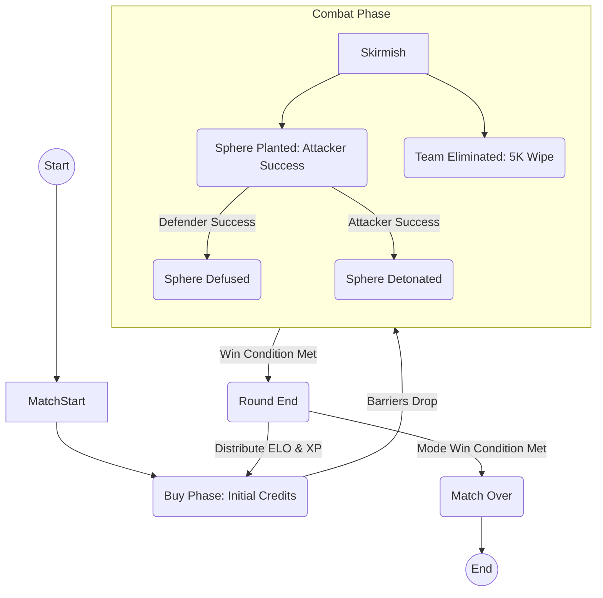
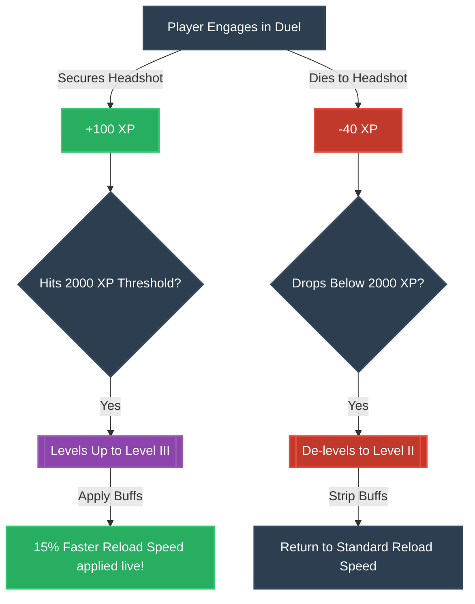
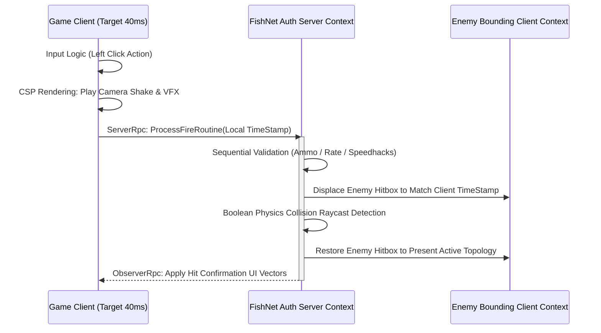
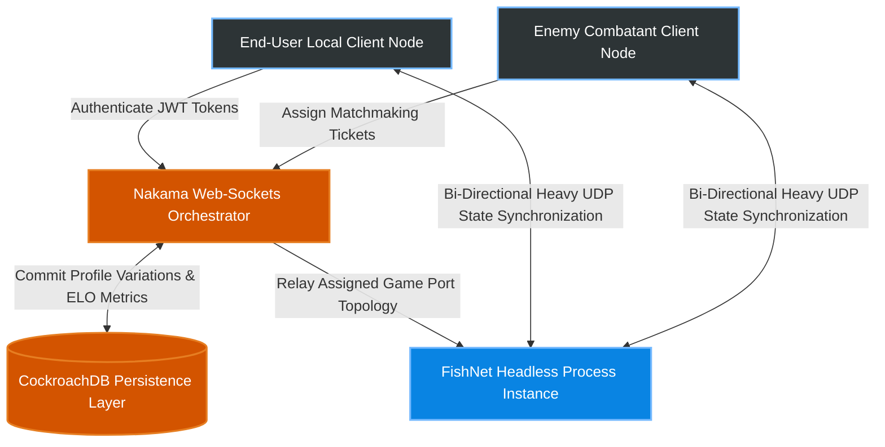
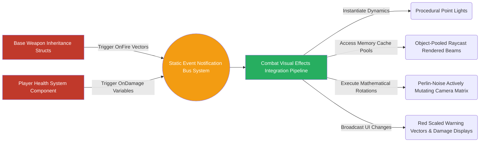

  
  
  
  

# ProjectZ: The Ultimate Tactical Hero Shooter 🎯

> **👋 Welcome A16Z Speedrun Reviewers:** Please see our **[Architecture Overview](Docs/Architecture.md)** for an in-depth dive into our Server-Authoritative Netcode, Lag Compensation (Hitbox Rewinding), and Dockerized FishNet Backend infrastructure.

**ProjectZ** is a next-generation competitive 5v5 Tactical Hero Shooter. Blending the unforgiving, precision-based gunplay of classic competitive shooters with the chaotic, dynamic variables of hero abilities, ProjectZ is built from the ground up for eSports, competitive integrity, and a premium "game feel."

Design note: the gameplay rules in this README are intended to mirror the canonical GDD. If a top-level summary here becomes stale, the GDD should be treated as the source of truth for mode flow, round rules, and hero design.

---

## 📖 Lore & Setting

Set in a near-future cyberpunk metropolis fractured by the discovery of "Z-Energy"—a paradoxical substance capable of bending time, space, and local physics—clandestine factions deploy highly specialized agents ("Heroes") to secure extraction zones. It is a tactical war of information, precision, and ultimate abilities governed by global supremacy.

---

## 🎮 Core Gameplay Loop

ProjectZ strictly follows a high-stakes, competitive **Round-Based Economy** loop.

1. **Buy Phase (20 seconds):** Players use credits earned from kills (200 cr), objectives (300 cr), round wins (3000 cr), and round losses (base 1900 cr scaling with losing streaks) to purchase weapons, armor, and abilities natively through the `BuyMenuUI`. Economy maximum is capped at 9000 credits for Ranked matches.
2. **Combat Phase (1:45 min):** A lethal 5v5 engagement. Time-to-Kill (TTK) is extremely low. A single well-placed headshot generally results in instant elimination.
3. **Objective (The Sphere):** The Attacking team must plant the **Sphere** at designated Sites (A, B, or C). Planting requires 4.0 seconds. The Sphere has a 45-second detonation timer. The Defending team must defuse it (7.0 seconds base, 3.5 seconds with a kit). The explosive kill radius upon detonation spans 35 meters.
4. **Round End & Progression:** The `RoundManager` handles phase transitions, scoreboard refreshes, and mode-dependent win checks. Halftime swaps, pistol rounds, and match-end thresholds are mode-specific and should follow the canonical GDD ruleset.

---

## 📈 Dynamic Weapon Mastery System

One of ProjectZ's heavily engineered features is its **Dynamic Weapon Mastery** loop. It is a live, in-match progression system where a player's mechanical performance directly impacts the physical handling metrics (Reload Speed, Fire Rate, Movement Speed, ADS Speed) of their held weapon. Damage outputs remain static globally to preserve absolute mechanical integrity.

### 🌟 Mastery XP Logic 
The system spans from **Level I** (0 XP) to **Level V** (4000+ XP). Each level threshold requires 1000 XP.

| Combat Action | Target/Condition | XP Modifier | System Rationale |
| :--- | :--- | :---: | :--- |
| **Kill** | Headshot | <b>+100 XP</b> | Maximally rewards pinpoint mechanical precision. |
| **Kill** | Body / Leg | <b>+50 XP</b> | Standard combat elimination reward. |
| **Assist** | Armor & HP Damaged | <b>+50 XP</b> | Rewards heavy contribution to a teammate's frag. |
| **Assist** | HP Only | <b>+25 XP</b> | Minor assist contribution or shield break. |
| **Utility** | Ultimate Cast | <b>+50 XP</b> | Rewards active execution of team-based abilities. |
| **Death** | Body / Leg | <b>-25 XP</b> | Standard penalty for losing a duel. |
| **Death** | Headshot | <b>-40 XP</b> | Harshly penalizes being out-aimed by an opponent. |
| **Penalty** | Cold Streak | <b>-60 XP</b> | Punishes securing 0 kills across 3 consecutive rounds. |
| **Griefing** | Sabotage/Toxic | <b>-85 XP</b> | Manual penalty applied for negative behavior. |

### ⚙️ Progression Flow & Stat Buffs
Buffs are systematically categorized by weapon class scaling multipliers. Advancing a weapon class modifies how it handles physically in combat, drastically improving utility without fundamentally altering its base Damage outputs.

**1. Assault Rifles (Balanced Lethality)**
*   **Level 1 (0 XP):** Base Stats
*   **Level 2 (1000 XP):** <b>+10%</b> ADS (Aim-Down-Sights) Speed
*   **Level 3 (2000 XP):** <b>+15%</b> Reload Speed
*   **Level 4 (3000 XP):** <b>+5%</b> Movement Speed
*   **Level 5 (Max):** <b>+15%</b> Fire Rate

**2. Submachine Guns / SMGs (Hyper-Mobility)**
*   **Level 1 (0 XP):** Base Stats
*   **Level 2 (1000 XP):** <b>+5%</b> Movement Speed
*   **Level 3 (2000 XP):** <b>+10%</b> Fire Rate
*   **Level 4 (3000 XP):** <b>+15%</b> ADS Speed
*   **Level 5 (Max):** <b>+25%</b> Reload Speed

**3. Sniper Rifles (Angle Dominance)**
*   **Level 1 (0 XP):** Base Stats
*   **Level 2 (1000 XP):** <b>+10%</b> Reload Speed
*   **Level 3 (2000 XP):** <b>+15%</b> Weapon Draw Speed
*   **Level 4 (3000 XP):** <b>+5%</b> Movement Speed
*   **Level 5 (Max):** <b>+30%</b> ADS Speed

**4. Sidearms / Pistols (Desperation Swaps)**
*   **Level 1 (0 XP):** Base Stats
*   **Level 2 (1000 XP):** <b>+10%</b> Movement Speed
*   **Level 3 (2000 XP):** <b>+15%</b> Reload Speed
*   **Level 4 (3000 XP):** <b>+20%</b> Fire Rate
*   **Level 5 (Max):** <b>+50%</b> Weapon Draw/Swap Speed

**5. Shotguns (Breaching Power)**
*   **Level 1 (0 XP):** Base Stats
*   **Level 2 (1000 XP):** <b>+10%</b> Movement Speed
*   **Level 3 (2000 XP):** <b>+15%</b> Faster Pump/Action animation execution
*   **Level 4 (3000 XP):** <b>+20%</b> Reload Speed
*   **Level 5 (Max):** <b>+15%</b> Fire Rate

*Note: Dropping a weapon completely wipes its Mastery XP memory arrays. A newly picked-up weapon by any player will automatically reset to Level I. First and Half-time Pistol Rounds explicitly disable Masteries & Ultimates.*

---

## 🦸 The Roster (13 Canonical Playable Agents)

ProjectZ features 13 highly tuned Agents spanning multiple architectural roles. Ultimate abilities require exactly 100% charge to activate (+15% per kill, +10% per assist).

1. <b>Jacob</b> **(The Anchor) - Defense/Strategy**
   * **Ultimate | Siege Breaker:** Creates a definitive tactical opening. Any bullets Jacob fires through a designated 3x3m environmental zone lose zero damage (0% drop-off) upon penetrating walls. Lasts for the current and subsequent round.
2. <b>Lagrange</b> **(The Flanker) - Duelist/Mobility**
   * **Ultimate | Quantum Rewind:** A high-risk spacetime fracture. Teleports Lagrange securely to the exact coordinate of the last enemy he engaged and killed. Must be utilized immediately within 15 seconds of the kill and grants an essential 1-second invulnerability shield upon materialization.
3. <b>Sentinel</b> **(The Support) - Information/Control**
   * **Ultimate | Panopticon:** Generates an enormous 150HP stationary vision construct. It systematically scans a monolithic 30m radius sphere, tracking any enemies within its Line-of-Sight and rendering aggressive wall-outlines highlighting them for the entire defending team. Active for 25 seconds.
4. <b>Sector</b> **(The Controller) - Area Control**
   * **Ultimate | Doomsday Charge:** Deploys a violently reactive sticky charge. Detonates in precisely 2.0 seconds flat. Inflicts 150 immediate damage spanning the 0-2m epicenter, decaying linearly outwards up to 8 meters. Opponents can severely mitigate the blast (50% reduction) if they react by crouching.
5. <b>Silvia</b> **(The Buffer) - Support/Tempo**
   * **Ultimate | Overdrive Core:** Engineers an extraordinary 60-meter elongated energy vector tunnel. Any allied troops operating inside the bounds acquire a +30% Movement Speed and +15% Fire Rate steroid buff. Opponents trapped within the structure are crushed via a 40% movement speed slow decay. Initial duration is 8 seconds, gaining +2 seconds for every secured elimination.
6. <b>Samuel</b> **(The Gambler) - Risk/Aggressive**
   * **Ultimate | Blood Pact:** Activates an insanely aggressive vampiric contract. Depletes 5 Health Points intrinsically for every bullet fired from Samuel's weapon, however, every successful kill violently heals him for an astounding 50 HP (with mechanics supporting active overhealing). Sinking below 30 HP activates a frantic 1.3x global damage multiplier.
7. <b>Jielda</b> **(The Hunter) - Crowd Control**
   * **Ultimate | Spirit Wolves:** Manipulates ethereal constructs to summon homing, AI-controlled spirit entities. The wolves autonomously track down the first 3 enemy combatants that have registered body damage within the round. Impact ensures a devastating 1.5-second debilitating movement/aim stun.
8. <b>Zauhll</b> **(The Stalker) - Stealth/Flank**
   * **Ultimate | Void Walk:** Phased entirely beyond the physical 3D dimension. Converts Zauhll into 100% true invisibility parameter status combined with a monumental +25% sprint capacity. The caveat forces Zauhll’s render vision cone to be agonizingly compressed to merely 3 meters directly forward for 7 seconds. Exiting stealth to land a first-hit guarantees 100% active weapon lifesteal recovery.
9. <b>Volt</b> **(The Disruptor) - Chaos/Global**
   * **Ultimate | System Failure:** Executes algorithmic chaos via an electronic EMP field spanning the servers. Forcefully compresses all enemy viewports to a catastrophic 5-meter boundary, deletes all HUD instances (Health bars, Crosshairs, Scoreboards, Ammo interfaces) and comprehensively mutes enemy internal VOIP (Voice Chat) for 5 punishing seconds.
10. <b>Sai</b> **(The Duelist) - Close Combat**
    * **Ultimate | Blade Dance:** Binds close-quarters combat logic to executing 3 highly targeted physical dashes. Strikes 1 and 2 lock targets within 4 meters, dealing 75 static damage while deploying a forward-facing kinetic barrier that completely nullifies incoming projectiles. The final 3rd Strike dramatically extends to a 6-meter lock, landing a 3-second crippling root condition.
11. <b>Helix</b> **(The Intel) - Psychological Pressure**
    * **Ultimate | One-Way Mirror:** Deploys an asymmetrical logic barrier measuring exactly 2.0x1.5 meters. Helix and allied entities process visual rendering cleanly through the plane entirely unobstructed, while opposition raycasts only perceive an intensely opaque, wavy energy shield. Helix sustains a +25 HP recovery condition for orchestrating combat sequences securely behind the mirror boundary.
12. <b>Kant</b> **(The Thief) - Flexible**
    * **Ultimate | Echo:** A profoundly terrifying psychological mechanic allowing total flexibility. By approaching any expired combatant’s capsule (friendly or hostile within a 3-meter vicinity), Kant physically extracts and overrides their specific Ultimate script. Kant has a strictly enforced 5-second countdown to unleash the stolen capability.
13. <b>Marcus 2.0</b> **(The Acrobat) - Mobility/Initiator**
    * **Ultimate | Grapple Strike:** Shoots a fully unadulterated, physics-influenced 25-meter kinetic grappling wire. Impacting terrestrial geometry pulls Marcus vigorously via angular momentum towards the point. Hooking a player organically pulls them into a staggered arrangement, inflicts 25 flat damage, and initiates a brutal 40% slow metric spanning 3 seconds. Gravity damage matrices are entirely bypassed (No Fall Damage) across the sequence duration.

---

## ⚙️ In-Depth Mechanics & Physics Engine

ProjectZ demands pinpoint accuracy, strict situational movement vectors, and deep systemic awareness to achieve the lowest possible TTK efficiently on the servers.

### 📐 Anatomy & Hitbox Mathematics (`HitboxCapsule`)
Network body structures are rigorously defined with hierarchical damage logic.
*   **Head/Neck Bone:** 12.0cm radius (Neck 8.0cm). Triggers a massive `4.0x Damage Multiplier`.
*   **Torso Zones:** Spine_01/03 structure mapping spanning 22.0cm to 25.0cm radiuses. Regarded as `1.0x Base Modifiers`.
*   **Extremity Volumes:** Limbs (Calfs/Arms) carry `0.85x Damage Multipliers` requiring significantly more bullets to kill.
*   *Optimization Layer:* Fast Distance-to-Axis checks evaluate bullet-collisions, and square-roots are calculated strictly locally at final processing validation.

### 🎯 Advanced Recoil, Spread, and Ballistics
Ammunition logic is handled primarily via High-Velocity Vector Rays (`P(t) = Origin + Direction * t`).
* **Deterministic Spray Patterns:** Sustained fire kicks the `PlayerCamera` organically before shifting laterally in purely calculated and fully memorizable patterns based off weapon instances.
* **Dynamic Crosshair Bloom:** Crosshairs calculate UI scaling formulas combining Base Gap values + Player Velocity variations + Current Output Firing Errors simultaneously.

### 🏃‍♂️ Counter-Strafing & Movement Paradigms
* Firing sequences initialized while a player maintains a Sprint (>200 speed) or Walk state drastically increases positional recoil arrays.
* Activating counter-strafing parameters (e.g. depressing 'D' while velocity leans 'A') mathematically zeroes movement vectors instantly ensuring the ultimate accuracy recovery.

### 🧱 Wallbanging & Spatial Material Penetration Algorithms
Surfaces in ProjectZ contain heavy contextual density metadata calculating Damage Falloff.
*   **Metal Systems:** Are entirely impenetrable (0.0 penetration power) maintaining Infinite Resistance arrays.
*   **Stone Bounds:** Cost 2.5 Resistance per penetrated centimeter (Capped at maximum dense limits of 30.0 cm).
*   **Wood Objects:** Highly malleable; consuming minimal bullet damage (0.8 Resistance calculations for every centimeter traversing outwards to 60.0 cm limits).
*   *Wallbang Logic*: A high-fidelity Heavy Sniper bullet penetrating standard Wood obstacles inherently limits target destruction to approx. 80% capability via Ray Marching equations compared to transparent impacts.

---

## 🎧 Advanced 3D Spatial Audio Engine Architecture 
Awareness dictates operational dominance. The engine parses sounds deeply contextually.

*   **Dynamic Raycast Occlusion:** Audio engine shoots a direct line connecting Audio Source to Player Context Camera. If a line meets Concrete, High Frequencies are severely aggressively clamped (`Occlusion = 0.7`), simulating a muffled presence compared to un-occluded transparent soundscapes.
*   **Material Footsteps:** Terrain parsing allocates specific Sound Arrays (Gravel vs Wood vs Water). Sneaking (Shift Key) reduces movement velocity explicitly <130, restricting footstep broadcast radiuses to an imperceptible 15m context vs the standard 40m bounding box of running strides.
*   **Audio Channel Prioritization Logic:** If the Engine plays Critical Channels (Headshot sounds, The Sphere Beeps) or Ultimate Callouts (*"Fire in the Hole!"*), lower hierarchy audio streams (Wind Ambiance, Raw Gunfire, Secondary footsteps) are instantly ducked mathematically by 40% volume internally preventing severe auditory clutter across critical moments.

---

## 🌐 Netcode: Server-Authoritative Lag Compensation (FishNet v4)
Engineered for eSports integrity demanding complete fairness and security validation. ProjectZ relies on **Client-Side Prediction (CSP) & True Server Reconciliation**.

*   **Hitbox Rewinding Logic:** When calculating shots from environments harboring Latency/Ping, visual feedback naturally feels slightly divergent. To rectify this, hitting the trigger broadcasts exact Local Timestamps within `ServerRpc` network queues. The authority Fishnet Server extracts the data, literally shifting the colliders of every participant backwards internally across milliseconds to physically match the shooter's specific timeframe logic before calculating boolean intersection rules.
*   **Entity Interpolation Algorithms:** Network instances observe opponent movement completely free from jitter arrays utilizing heavy dense linear interpolating variables buffering exact opponent representations locally. 
*   **Bit-Packing Position Data:** Network limits are mitigated by compressing vectors down drastically (eg `CompressedValue = ((WorldPos - MinMap) / (MaxMap - MinMap)) * 65535`) assuring incredibly light UDP packet configurations maintaining high Tick Rates reliably.

---

## 🕹️ Game Modes

ProjectZ supports a diverse suite of network-synchronized game modes via the `BaseGameMode` architecture context:
1. **Ranked (Standard):** Main competitive ruleset with strict economy caps at 9,000, halftime after round 12, pistol rounds on rounds 1 and 13, and win-by-two overtime as defined by the GDD.
2. **Fast Fight:** Shortened competitive ruleset with 1:30 rounds, accelerated economy, halftime after round 9, and pistol rounds on rounds 1 and 10.
3. **Duel Chaos:** A hectic **2v2v2v2v2 (5 teams of 2)** continuous deathmatch model. Instant algorithmic respawns (3.0s delays) spanning 10-minutes. The designated duo reaching 100 combat kills claims extreme victory. Masteries completely stripped. 
4. **Solo Tournament:** A gladiator-style **1v1 Arena Framework**. 5v5 lobby segments intelligently into specific observer states while Attackers and Defenders continuously queue for rotating synchronized individual 1v1 sequences center-stage until the designated organization secures 6 victories locking down the match entirely.

---

## 🏗️ Backend System Architecture 

Utilizing enterprise configurations for scaling matchmakers rapidly globally.

### Infrastructure Networking (Nakama + CockroachDB)
* Hashicorp's **Nakama Backend** serves as our central nervous system orchestrating deep queues and sessions.
* Employs internal database arrays via **CockroachDB**, tracking internal Player Profiling metrics heavily tied to scaling mathematical ELO configurations across specific matchmaking iterations natively.

### The Procedural VFX Sub-Systems (Zero-Art Logic Flow)
An incredibly intense 10-tier feedback integration sequence driven entirely via algorithmic code rather than heavy visual assets guaranteeing memory optimization boundaries.
1. `CombatVFXBridge` leverages event bus protocols natively picking up `OnFire` and `OnDamage` boolean triggers instantly avoiding inspector references.
2. Spawns PointLights tracking fire-rate algorithms directly natively dynamically.
3. Distributes highly optimized `LineRenderer` vectors functioning as Bullet Tracer architectures pooled internally via native caching methodologies fading globally mathematically across precisely 80ms windows smoothly.
4. Executes complex UI Canvas behaviors initiating dense Red Vignettes spanning border parameters alongside directional blood splatter configurations depending intimately upon vector damage incoming data structures.

---

## 🚀 DevOps Lifecycle & Global Deployments

Repository systems natively output Docker Image configurations built explicitly on minimal footprint Alpine architectures targeting orchestrated global containerization systems natively.

*   `Dockerfile.server` structures lightweight standalone environments internally executing binaries flawlessly natively.
*   Automated workflow topologies natively build and sequentially deploy containerized arrays spanning `docker-compose` capabilities targeting AWS GameLift structures via internal Edge Orchestration integrations minimizing runtime variations globally entirely natively locally directly automatically smoothly globally.

---
*Created as an ultimate masterclass in modern Unity Protocol Paradigms, Systems Architecture integrations, and Networking execution capabilities flawlessly natively globally.*
